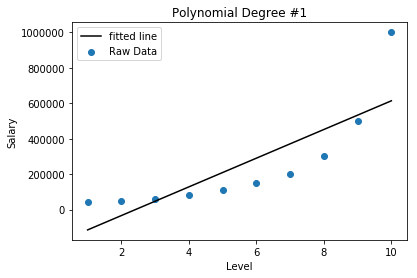
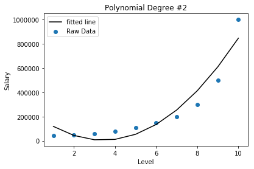
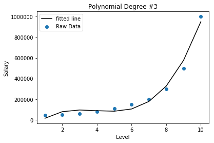
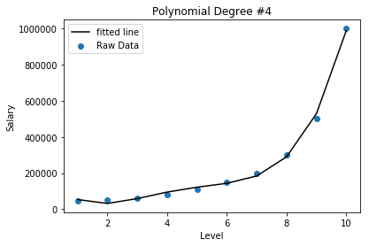
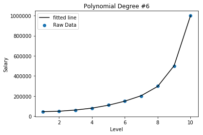
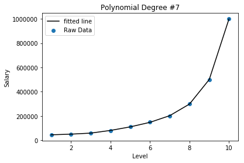
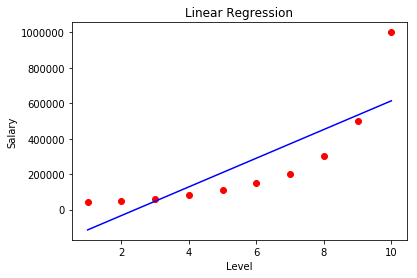
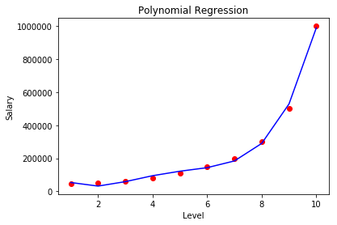

# Polynomial Regression



import numpy as np
import pandas as pd
import matplotlib.pyplot as plt
%matplotlib inline



```python
dataset = pd.read_csv("Position_Salaries.csv")
dataset
```


<div>
<style>
    .dataframe thead tr:only-child th {
        text-align: right;
    }

    .dataframe thead th {
        text-align: left;
    }

    .dataframe tbody tr th {
        vertical-align: top;
    }
</style>
<table border="1" class="dataframe">
  <thead>
    <tr style="text-align: right;">
      <th></th>
      <th>Position</th>
      <th>Level</th>
      <th>Salary</th>
    </tr>
  </thead>
  <tbody>
    <tr>
      <th>0</th>
      <td>Business Analyst</td>
      <td>1</td>
      <td>45000</td>
    </tr>
    <tr>
      <th>1</th>
      <td>Junior Consultant</td>
      <td>2</td>
      <td>50000</td>
    </tr>
    <tr>
      <th>2</th>
      <td>Senior Consultant</td>
      <td>3</td>
      <td>60000</td>
    </tr>
    <tr>
      <th>3</th>
      <td>Manager</td>
      <td>4</td>
      <td>80000</td>
    </tr>
    <tr>
      <th>4</th>
      <td>Country Manager</td>
      <td>5</td>
      <td>110000</td>
    </tr>
    <tr>
      <th>5</th>
      <td>Region Manager</td>
      <td>6</td>
      <td>150000</td>
    </tr>
    <tr>
      <th>6</th>
      <td>Partner</td>
      <td>7</td>
      <td>200000</td>
    </tr>
    <tr>
      <th>7</th>
      <td>Senior Partner</td>
      <td>8</td>
      <td>300000</td>
    </tr>
    <tr>
      <th>8</th>
      <td>C-level</td>
      <td>9</td>
      <td>500000</td>
    </tr>
    <tr>
      <th>9</th>
      <td>CEO</td>
      <td>10</td>
      <td>1000000</td>
    </tr>
  </tbody>
</table>
</div>


## Analysis 


```python
dataset.corr()
```


<div>
<style>
    .dataframe thead tr:only-child th {
        text-align: right;
    }

    .dataframe thead th {
        text-align: left;
    }

    .dataframe tbody tr th {
        vertical-align: top;
    }
</style>
<table border="1" class="dataframe">
  <thead>
    <tr style="text-align: right;">
      <th></th>
      <th>Level</th>
      <th>Salary</th>
    </tr>
  </thead>
  <tbody>
    <tr>
      <th>Level</th>
      <td>1.000000</td>
      <td>0.817949</td>
    </tr>
    <tr>
      <th>Salary</th>
      <td>0.817949</td>
      <td>1.000000</td>
    </tr>
  </tbody>
</table>
</div>


```python
dataset.Position.value_counts()
```


    Business Analyst     1
    Region Manager       1
    CEO                  1
    Senior Consultant    1
    Country Manager      1
    C-level              1
    Partner              1
    Manager              1
    Senior Partner       1
    Junior Consultant    1
    Name: Position, dtype: int64


```python
dataset.info()
```

    <class 'pandas.core.frame.DataFrame'>
    RangeIndex: 10 entries, 0 to 9
    Data columns (total 3 columns):
    Position    10 non-null object
    Level       10 non-null int64
    Salary      10 non-null int64
    dtypes: int64(2), object(1)
    memory usage: 320.0+ bytes


<div class="alert alert-block alert-info">
<h3> Start Playground </h3>
</div>

### Example Creating a function to convert to polynomial


```python
def polynomial(degree, feature):
    poly_data = pd.DataFrame()
    poly_data['power_1'] = feature
    power = degree
    
    if power > 1:
        for i in range(2, degree+1):
            fstr = 'power_' + str(i)
            poly_data[fstr] = feature ** i
    return poly_data
```


```python
#Test function
print(polynomial(16,np.array([1,2,3])))
```

       power_1  power_2  power_3  power_4  power_5  power_6  power_7  power_8  \
    0        1        1        1        1        1        1        1        1   
    1        2        4        8       16       32       64      128      256   
    2        3        9       27       81      243      729     2187     6561   
    
       power_9  power_10  power_11  power_12  power_13  power_14  power_15  \
    0        1         1         1         1         1         1         1   
    1      512      1024      2048      4096      8192     16384     32768   
    2    19683     59049    177147    531441   1594323   4782969  14348907   
    
       power_16  
    0         1  
    1     65536  
    2  43046721  


```python
from sklearn.linear_model import LinearRegression
```


```python
x = dataset.Level
power = 7
for i in range(1,power+1):
    poly = polynomial(i, x)
    slr = LinearRegression()
    slr.fit(poly, dataset.Salary)
    j = slr.predict(poly)
    plt.title("Polynomial Degree #"+ str(i))
    plt.ylabel("Salary")
    plt.xlabel("Level")
    plt.scatter(x, dataset.Salary, label="Raw Data")
    plt.plot(x, j, 'k', label="fitted line")
    plt.legend()
    plt.show()
```




















<div class="alert alert-block alert-info">
<h3> End playground </h3>
</div>


## Data Preprocessing


```python
dataset.head(2)
```


<div>
<style>
    .dataframe thead tr:only-child th {
        text-align: right;
    }

    .dataframe thead th {
        text-align: left;
    }

    .dataframe tbody tr th {
        vertical-align: top;
    }
</style>
<table border="1" class="dataframe">
  <thead>
    <tr style="text-align: right;">
      <th></th>
      <th>Position</th>
      <th>Level</th>
      <th>Salary</th>
    </tr>
  </thead>
  <tbody>
    <tr>
      <th>0</th>
      <td>Business Analyst</td>
      <td>1</td>
      <td>45000</td>
    </tr>
    <tr>
      <th>1</th>
      <td>Junior Consultant</td>
      <td>2</td>
      <td>50000</td>
    </tr>
  </tbody>
</table>
</div>


```python
#adding [:, 1:2] to make it a matrix as oppsed to [:, 1] which makes it only a vector
x = dataset.iloc[:, 1:2] 
y = dataset.iloc[:, -1]
x.sort_values
```


    <bound method DataFrame.sort_values of    Level
    0      1
    1      2
    2      3
    3      4
    4      5
    5      6
    6      7
    7      8
    8      9
    9     10>


```python
#not necessary here since the data is extemely small 
# from sklearn.cross_validation import train_test_split
# x_train, y_train, x_test, y_test = train_test_split(x, y, test_size=0.2, random_state = 0)
```

### Create two models to compare: Simple Linear Regression and Polynomial Regression


```python
#1 Linear Regression
from sklearn.linear_model import LinearRegression
lin_reg = LinearRegression()
lin_reg.fit(x,y)
lin_reg.predict(x)
```


    array([-114454.54545455,  -33575.75757576,   47303.03030303,
            128181.81818182,  209060.60606061,  289939.39393939,
            370818.18181818,  451696.96969697,  532575.75757576,
            613454.54545455])


```python
#2 Polynomial Regression
from sklearn.preprocessing import PolynomialFeatures
poly_reg = PolynomialFeatures(degree= 4)
x_poly = poly_reg.fit_transform(x)
lin_reg2 = LinearRegression()
lin_reg2.fit(x_poly, y)
```


    LinearRegression(copy_X=True, fit_intercept=True, n_jobs=1, normalize=False)


Visualize the two to compare.


```python
plt.scatter(x.Level.astype(int), y, color='red')
plt.plot(x, lin_reg.predict(x), color='blue')
plt.title("Linear Regression")
plt.xlabel('Level')
plt.ylabel('Salary')
```


    Text(0,0.5,'Salary')





```python
plt.scatter(x.Level.astype(int), y, color='red')
plt.plot(x, lin_reg2.predict(x_poly), color='blue')
plt.title("Polynomial Regression")
plt.xlabel('Level')
plt.ylabel('Salary')
```


    Text(0,0.5,'Salary')





** Salary Prediction for Level 6.5 **


```python
#predictions
test_val = 6.5 #what about salary for someone at level 6.5
test_val_poly = poly_reg.transform(test_val)

print('Prediction using Linear Regression = ', lin_reg.predict(test_val))
print('Prediction using Polynomia Regression = ', lin_reg2.predict(test_val_poly))
```

    Prediction using Linear Regression =  [ 330378.78787879]
    Prediction using Polynomia Regression =  [ 158862.45265153]


```python
#HIGHER RESOLUTION AND SMOOTHER CURVE
x_grid = np.arange(min(x.Level.astype(int)), max(x.Level.astype(int)), 0.1)
x_grid = x_grid.reshape((len(x_grid), 1))


plt.scatter(x.Level.astype(int), y, color='red')
plt.plot(x_grid, lin_reg2.predict(poly_reg.fit_transform(x_grid)), color='blue')
plt.title("Polynomial Regression")
plt.xlabel('Level')
plt.ylabel('Salary')
```


    Text(0,0.5,'Salary')


```python
test_val_poly
```


    array([[  1.00000000e+00,   6.50000000e+00,   4.22500000e+01,
              2.74625000e+02,   1.78506250e+03]])


