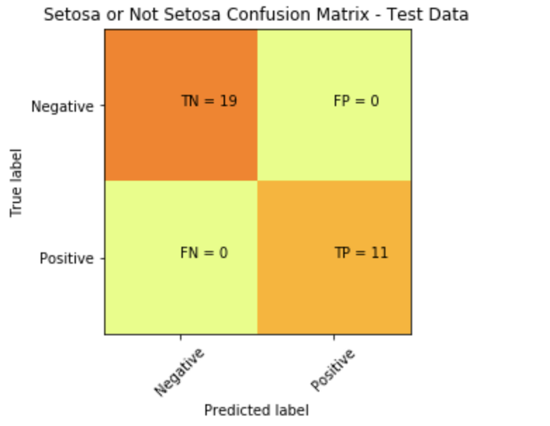

---
layout: post
post: How to plot a Confusion Matrix in Python
---

Here is an example on how you can plot the Confusion Matrix from Scikit Learn in a visual format that makes it easier to understand. 

The documentation for **[Confusion Matrix](http://scikit-learn.org/stable/modules/generated/sklearn.metrics.confusion_matrix.html)** is pretty good, but I struggled to find a quick way to add labels and display the output into an easy to read format.

For a good introductory read on confusion matrix check out this great post:  

http://www.dataschool.io/simple-guide-to-confusion-matrix-terminology/

Let's go through a quick Logistic Regression example using Scikit-Learn:

```python
import numpy as np
import pandas as pd
import matplotlib.pyplot as plt

from sklearn import datasets
data = datasets.load_iris()

df = pd.DataFrame(data.data, columns=data.feature_names)

```

We can examing our data quickly using Pandas Correlation function to pick a suitable feature for out logistic regression.


```python
corr = df.corr()
corr.Target
```


    >>> output
    sepal length (cm)    0.782561
    sepal width (cm)    -0.419446
    petal length (cm)    0.949043
    petal width (cm)     0.956464
    Target               1.000000
    Name: Target, dtype: float64


So, let's pick Petal Widthh (cm) as our X independent variable. For our Target/dependent variable Y we can pick Setosa. Since for Target we have three choices, to simplify our task and narrow it down to a binary classifier: either it is Setosa or it is Not Setosa.

```python
data.target_names
```

    >>> output
    array(['setosa', 'versicolor', 'virginica'],
      dtype='<U10')

Let's now create X and Y:

```python
x = df.iloc[0: ,3].reshape(-1,1)
y = (data.target == 0).astype(np.int)
```
Now, let's split our data and then start building our Logistic Regression model.

```python
from sklearn.cross_validation import train_test_split

x_train, x_test, y_train, y_test = train_test_split(x,y, test_size = 0.20, random_state = 0)

from sklearn.linear_model import LogisticRegression
logit = LogisticRegression(random_state= 0)
logit.fit(x_train, y_train)

y_predicted = logit.predict(x_test)
```

Now, let's examin our confusion matrix:

```python
from sklearn.metrics import confusion_matrix

cm = confusion_matrix(y_test, y_predicted)
print(cm)
```

    >>> output
    [[19  0]
    [ 0 11]]

The confusion matrix tells us we got everything classified correctly (in terms of: Setsosa, or Not Setosa). A better way to visualize this can be accomplsihed with the code below:

```python
plt.imshow(cm, interpolation='nearest', cmap=plt.cm.Wistia)
classNames = ['Negative','Positive']
plt.title('Setosa or Not Setosa Confusion Matrix - Test Data')
plt.ylabel('True label')
plt.xlabel('Predicted label')
tick_marks = np.arange(len(classNames))
plt.xticks(tick_marks, classNames, rotation=45)
plt.yticks(tick_marks, classNames)
s = [['TN','FP'], ['FN', 'TP']]

for i in range(2):
    for j in range(2):
        plt.text(j,i, str(s[i][j])+" = "+str(cm[i][j]))
```



Hope this helps.